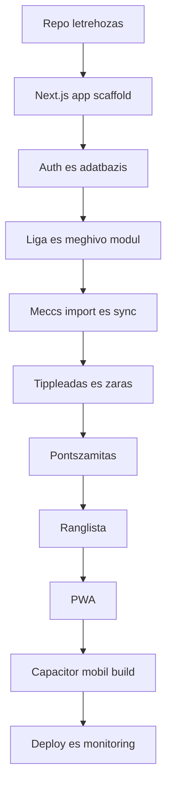
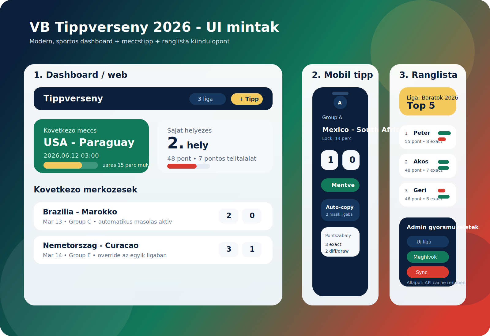

# VB Tippverseny 2026 - projekt tervrajz

## 0. Projektcel roviden

Egy webes, kesobb Androidra es iOS-re is telepitheto alkalmazas keszul, ahol a barati tarsasag ligakban tud tippelni a 2026-os FIFA vilagbajnoksag meccseire.

Az alkalmazas fo szabalyai:

- van egy `superadmin`, aki ligakat hoz letre es meghivokat kuld
- egy felhasznalo tobb ligaban is reszt vehet
- az elso ligaban leadott tipp alapbol automatikusan bekerul a tobbi ligaba is
- a tippleadas a meccs kezdete elott 15 perccel zar
- pontozas:
  - pontos eredmeny: `3 pont`
  - gyoztes + golkulonbseg eltalalasa, valamint a nem pontosan eltalalt dontetlen: `2 pont`
  - csak a gyoztes eltalalasa: `1 pont`
  - minden mas: `0 pont`
- az egyenes kieseses szakaszban csak a rendes jatekido eredmenye szamit
- a hosszabbitas (`2x15 perc`) es a 11-es parbaj nem szamit bele a tipp kiertékelesebe

Aktualis verseny-alapadatok, amelyeket a dokumentum tervezeskor ellenoriztem:

- a FIFA World Cup 2026 nyito merkozese: `2026-06-11`
- a donto: `2026-07-19`
- formatum: `48 csapat`, `104 merkozes`

Forrasok: [FIFA groups and format](https://www.fifa.com/en/articles/groups-how-teams-qualify-tie-breakers), [FIFA schedule page](https://www.fifa.com/en/tournaments/mens/worldcup/canadamexicousa2026/articles/match-schedule-fixtures-results-teams-stadiums)

---

## 1. Technikai kovetelmenyek es szukseges szoftverek

## 1.1 Javasolt architektura

Cel: minel tobb minden Next.js-ben maradjon, es csak ott lepjunk ki native iranyba, ahol tenyleg muszaj.

Javasolt stack:

- `Next.js` App Router + `TypeScript`
- `React` a teljes kliens UI-hoz
- `Tailwind CSS` a gyors, modern UI fejleszteshez
- `shadcn/ui` vagy sajat komponenskeszlet a konzisztens felulethez
- `Auth.js` bejelentkezeshez es sessionkezeleshez
- `Prisma` ORM
- `PostgreSQL` adatbazis
- `Resend` vagy `Postmark` email meghivokhoz
- `Vercel` vagy hasonlo hosting a Next.js appnak
- `Vercel Cron` vagy kulon idozitett worker a merkozesek, eredmenyek es zarasi idok szinkronizalasahoz
- `next-pwa` a telepitheto webapphoz
- `Capacitor` a kesobbi Android/iOS csomagolashoz, ha app store-os terjesztes is kell

Mi maradjon Next.js-ben:

- publikus landing oldal
- auth oldalak
- ligak kezelese
- meghivok elfogadasa
- meccslista es tippleadas
- ranglista es statisztika
- admin feluletek
- szerver oldali API route-ok / server actionok

Mi lehet kulso szolgaltatas:

- adatbazis
- email kuldes
- sportadat API
- cron / scheduled sync

## 1.2 Mi kell a fejleszteshez

Alap fejlesztoi eszkozok:

- `Git`
- `GitHub` vagy `GitLab` repo
- `Node.js` LTS
- `pnpm` csomagkezelo
- `VS Code`
- `Postman` vagy `Bruno` API teszteleshez
- `Docker Desktop` opcionisan helyi adatbazishoz

Mobil csomagolashoz:

- Android buildhez `Android Studio`
- iOS buildhez `Xcode` es `macOS` szukseges

Megjegyzes:

- iPhone-ra "telepitheto" verzio mar a PWA-val is elerheto lehet Safari alol
- App Store publikaciohoz viszont tenyleges native csomagolas kell
- emiatt a javasolt sorrend: `web + PWA eloszor`, `Capacitor kesobb`

## 1.3 Infrastrukturai kovetelmenyek

- SSL-es domain
- PostgreSQL adatbazis
- biztonsagos titokkezeles (`DATABASE_URL`, email API kulcsok, auth secret)
- naplozas es hibakovetes
- rendszeres backup
- idozitett feladatfuttatas

Javasolt kezdo hosting:

- frontend/backend: `Vercel`
- adatbazis: `Neon` vagy `Supabase Postgres`
- email: `Resend`

## 1.4 Funkcionalis domain modell

Fo entitasok:

- `User`
- `League`
- `LeagueMembership`
- `Invitation`
- `Team`
- `Match`
- `MatchResult`
- `Prediction`
- `ScoreEntry`
- `AuditLog`

Fo szerepkorok:

- `superadmin`
- `league_member`

Ha kesobb kell, bevezetheto egy koztes `league_admin` is, de indulashoz nem feltetlenul szukseges.

## 1.5 Adatmodell-javaslat a kulonleges szabalyokhoz

### Automatikus tippmasolas tobb ligaba

Erre a legjobb kompromisszum:

- minden felhasznalonak ligankent sajat `Prediction` rekordja van
- az elso aktiv ligaban leadott tipp lesz az alap
- amikor a felhasznalo masik ligaban megnyitja ugyanazt a meccset, a rendszer automatikusan letrehozza a tippet az alap tipp alapjan, ha ott meg nincs egyedi modositasa
- ha a felhasznalo egy adott ligaban atirja, akkor ott `isOverride = true`

Igy:

- egyszeru marad a pontszamitas
- ligankent kulon lehet modositani
- nincs bonyolult, valos ideju rekord-osszekotes

### 15 perces zaras

Nem eleg csak frontenden tiltani. Kell:

- frontend tiltott allapot
- backend ellenorzes menteskor
- adatbazis szintu audit log

Szabaly:

- `lockAt = kickoffAt - 15 minutes`
- ha a szerver oldali ido nagyobb vagy egyenlo `lockAt`, akkor a mentes elutasitando

### Pontszamitas

Javasolt implementacios szabaly:

1. `3 pont`, ha a hazai es vendeg gol is pontosan stimmel
2. `2 pont`, ha:
   - ugyanaz a vegkimenetel es ugyanaz a golkulonbseg, vagy
   - dontetlen lett a meccs, es a tipp is dontetlen, de nem pontos eredmennyel
3. `1 pont`, ha csak a vegkimenetel stimmel
4. `0 pont` egyebkent

Peldak:

- valos eredmeny `2-1`, tipp `2-1` -> `3`
- valos eredmeny `3-1`, tipp `2-0` -> `2`
- valos eredmeny `2-2`, tipp `2-2` -> `3`
- valos eredmeny `1-1`, tipp `0-0` -> `2`
- valos eredmeny `2-1`, tipp `1-0` -> `1`
- valos eredmeny `1-2`, tipp `2-1` -> `0`

### Egyenes kieseses szakasz szabaly

Az egyenes kieseses meccseknel csak a rendes jatekido vegeredmenyet kell figyelembe venni a tippek kiertékelésehez.

Ez azt jelenti:

- a hosszabbitas (`2x15 perc`) nem szamit bele
- a 11-es parbaj nem szamit bele
- a tovabbjutas tenye nem befolyasolja a pontozast
- mindig a 90 perc vegi allas alapjan kell pontot szamolni

Pelda:

- rendes jatekido: `1-1`
- hosszabbitas utan: `2-1`, vagy 11-esekkel dől el a továbbjutás

A tippjatek szempontjabol a hivatalos eredmeny ekkor is `1-1`.

---

## 2. Munkafolyamat es megvalositasi lepesek

## 2.1 Magas szintu rendszerfolyamat

```mermaid
flowchart LR
    A[Superadmin letrehozza a ligat] --> B[Email meghivo kikuldese]
    B --> C[Felhasznalo elfogadja a meghivot]
    C --> D[Felhasznalo latja a meccseket]
    D --> E[Elso ligaban tipp leadasa]
    E --> F[Rendszer mas ligakba alapbol atmasolja]
    F --> G[Felhasznalo szukseg eseten ligankent modosit]
    G --> H[15 perccel kezdes elott zaras]
    H --> I[API-bol vagy sync workerbol eredmeny erkezik]
    I --> J[Pontszamitas]
    J --> K[Ranglista es statisztika frissites]
```

## 2.2 Technikai munkafolyamat fejlesztesi szemmel

## 2.3 Konkret megvalositasi fazisok

### Fazis 0 - Repo es alapok

- Git repo letrehozas
- branching strategia rogzitese
- Next.js + TypeScript + Tailwind induloprojekt
- formatter es lint beallitas (`ESLint`, `Prettier`)
- CI alapszint: lint + build

### Fazis 1 - Auth es user alapok

- emailes login vagy magic link
- felhasznaloi profil
- szerepkorok bevezetese
- meghivo elfogadas auth utan

### Fazis 2 - Liga modul

- superadmin letrehoz ligat
- liga adatai szerkeszthetők
- meghivok kuldese emailben
- tagsag kezelese

### Fazis 3 - Meccs es csapat adatok

- VB menetrend import API-bol
- csapatok es meccsek tarolasa
- UTC-ben tarolt kickoff ido
- lokalizalt megjelenites a felhasznalo idozonaja szerint

### Fazis 4 - Tippeles

- meccslistazo oldal
- tipp beviteli UI
- auto-copy az elso ligabol
- override kezeles
- zarasi szabaly ellenorzese

### Fazis 5 - Eredmeny sync es pontszamitas

- scheduler a meccsek frissitesere
- vegeredmeny rogzitese
- pontszamitas es leaderboard ujraszamolas
- audit log

### Fazis 6 - UX, mobil es telepitheto app

- PWA ikonok, manifest, offline shell
- push ertesites kesobb opcionasan
- Android/iOS csomagolas Capacitorral

### Fazis 7 - Stabilizalas es indulasi felkeszules

- vegpontok terheleses tesztje
- biztonsagi atnezes
- backup, monitoring, error tracking
- beta teszt szuk barati korben

## 2.4 Javasolt backlog sorrend

Elso sprint:

- projekt scaffold
- adatmodell
- auth
- liga letrehozas
- meghivo elfogadas

Masodik sprint:

- meccs import
- tippoldal
- zarasi logika
- auto-copy

Harmadik sprint:

- pontszamitas
- leaderboard
- admin sync
- dizajn finomitas

Negyedik sprint:

- PWA
- tesztek
- deploy

## 2.5 Git munkarend

Javasolt branch-ek:

- `main` - stabil
- `develop` - integracios
- `feature/...` - egyes fejlesztesek
- `fix/...` - hibajavitas

Javasolt commit stilus:

- `feat: add league invitation flow`
- `feat: implement prediction lock window`
- `fix: score draw predictions correctly`
- `docs: add initial architecture blueprint`

Minden merge elott minimum:

- lint
- typecheck
- build

---

## 3. UI design mintak

Keszitettem egy indulasi UI mintalapot SVG-ben:

## 3.1 Vizuális irany

Modern, sportos, de nem tulzsufolt stilus.

Javasolt szinrendszer:

- mely navy: `#0B1F3A`
- stadion zold: `#127A5A`
- elenk piros: `#D93A2F`
- arany akcentus: `#F4C95D`
- vilagos felulet: `#F6F8FB`

Fontos jogi megjegyzes:

- FIFA logot, hivatalos VB logot es hivatalos brand-elemeket ne masoljuk be engedely nelkul
- hasznaljunk "VB ihlette" vizualis vilagot, ne hivatalos arculatot

## 3.2 Fokepernyok

### A. Dashboard

Tartalom:

- kozelgo merkozesek
- aktiv ligak
- sajat allas
- gyors "tipplek most" CTA

### B. Tippeles oldal

Tartalom:

- meccs kartya
- kezdes idopontja
- zaras visszaszamlalo
- hazai es vendeg gol input
- jelzes, ha a tobbi ligaba is atmasolodik

### C. Liga ranglista

Tartalom:

- helyezes
- nev
- pontszam
- pontos talalatok szama
- utolso 5 meccs formajelzes

### D. Admin felulet

Tartalom:

- uj liga letrehozas
- meghivottak listaja
- meghivok ujrakuldese
- meccs import allapota
- sync logok

## 3.3 UX szabalyrendszer

- a meccsek mindig egyertelmu "nyitott" vagy "zarva" allapotot mutassanak
- a mentett tippek azonnal kapjanak vizualis visszajelzest
- a lock ido legyen mindig a felhasznalo helyi idejeben is lathato
- leaderboardon latszodjon, mibol jott a pontazonossag feloldasa

---

## 4. Ingyenes vagy reszben ingyenes API lehetosegek

Az alábbi lista friss, ellenorzott forrasokra epul. A "free" resz nem mindenhol jelenti ugyanazt: van ahol teljesen ingyenes, van ahol limitacios free tier van, es van ahol az elo livescore csak fizetos csomagban elerheto.

## 4.1 Osszehasonlito tabla

| API | Ingyenes? | Menetrend | Eredmeny | Elo livescore | Megjegyzes |
| --- | --- | --- | --- | --- | --- |
| `API-Football` | Igen, free tier | Igen | Igen | Igen | Free csomagban `100 request/nap`, minden competition benne van, de a free csomag szezonlimites |
| `football-data.org` | Igen | Igen | Igen | Nem a sima free tierben | A free tierben a `Worldcup` benne van, de a score es schedule kesleltetett |
| `OpenLigaDB` | Igen | Igen | Igen | Részben / kozossegi alapon | Public, auth nelkuli, kozossegi adatforras |
| `TheSportsDB` | Igen | Igen | Igen | Nem free tierben | Free API key: `123`, livescore a premium/V2 vonalon van |
| `worldcupjson.net` | Igen | Igen | Igen | Igen | Nem hivatalos, maga az oldal is jelzi, hogy nincs garancia a pontossagra vagy folyamatos elerhetosegre |

## 4.2 Reszletes ertekeles

### 1. API-Football

Miert eros jelolt:

- a pricing oldal szerint van `Free` csomag
- a free tier `100 Requests / day`
- a free tierben szerepel a `Livescore`, `Fixtures`, `Events`
- a coverage oldal szerint minden competition benne van, koztuk a `World Cup`

Mikor jo valasztas:

- ha kell elo eredmeny
- ha vallalhato az eros cache-elés
- ha a napi keret eleg a barati koros apphoz

Kockazat:

- napi 100 hivas hamar elfogyhat, ha tul surun frissitesz

Forrasok:

- [API-Football pricing](https://www.api-football.com/pricing)
- [API-Football coverage](https://www.api-football.com/coverage)

### 2. football-data.org

Mi jo benne:

- a free plan "free forever"
- a coverage oldal szerint a `Worldcup` benne van az ingyenes tierben
- tiszta, fejlesztobarát dokumentacio

Korlatozas:

- a free planben a `Scores delayed` es `Schedules delayed`
- vagyis teljesen valos ideju tabellahoz/tippjatekhoz onmagaban nem idealis

Mikor ajanlott:

- indulaskor menetrend seedelesre
- backup adatforraskent
- alacsony terhelesu admin sync-re

Forrasok:

- [football-data.org pricing](https://www.football-data.org/pricing)
- [football-data.org coverage](https://www.football-data.org/coverage)

### 3. OpenLigaDB

Mi jo benne:

- auth nelkuli, nyilvanos API
- a fooldal kifejezetten tippspiel/tippjatek celra ajanlja
- a jelenlegi ligalistaban latszik a `WM 2026`

Kockazat:

- kozossegi adatforras, ezert a minoseg es frissesseg ligankent valtozhat
- nagyobb uzembiztonsagi igenynel kell melle fallback

Forras:

- [OpenLigaDB](https://www.openligadb.de/)

### 4. TheSportsDB

Mi jo benne:

- van nyilvanos free API
- a dokumentacio szerint a free key: `123`
- free oldalon is jo alap a schedule/fixture adatokhoz

Korlatozas:

- a rate limit `30 request/minute`
- a dokumentacio szerint a `livescores` es a `V2 API` a premium reszhez tartozik

Forras:

- [TheSportsDB documentation](https://www.thesportsdb.com/documentation)

### 5. worldcupjson.net

Mi jo benne:

- direkt VB-fokuszu API
- a fooldal szerint "All match data, updated in real time"

Kockazat:

- ugyanott kulon jelzik, hogy nincs garancia a pontossagra vagy arra, hogy a szolgaltatas folyamatosan elerheto marad
- inkabb kiserleti vagy fallback/adatellenorzo celra ajanlott

Forras:

- [worldcupjson.net](https://worldcupjson.net/)

## 4.3 Ajanlott adatstrategia

Ha tenyleg ingyenes indulast szeretnel, ezt javaslom:

### Indulo verzio

- menetrend es alap meccsadatok: `football-data.org`
- alternativa / ellenorzo adatforras: `OpenLigaDB`

### Ha kell kozel valos ideju eredmeny

- elso valasztas: `API-Football` free tier eros cache-el
- fallback: `OpenLigaDB`

### Praktikus cache szabaly

- meccsnapokon csak az aznapi vagy kovetkezo 24 oras merkozeseket frissitsd gyakrabban
- aktiv, folyamatban levo meccseknel `1-3 perc` polling
- mas meccseknel ritkabb sync
- minden API valaszt DB-be cache-elj, ne a kliens hivja kozvetlenul a kulso API-t

## 4.4 Vegso ajanlas

Ha ma kezdenem a projektet, ezt a kombinaciot valasztanam:

1. `Next.js + TypeScript + Prisma + PostgreSQL`
2. `Auth.js`
3. `Resend`
4. `football-data.org` seedelesre
5. `API-Football` vagy `OpenLigaDB` eredmenyfrissitesre
6. `PWA` indulaskor, `Capacitor` a kesobbi store release-hez

---

## 5. Minimalis indulasi technikai roadmap

1. Hozz letre egy `Next.js` appot TypeScripttel es Tailwinddel.
2. Koss ra egy Postgres adatbazist Prisma-val.
3. Vezesd be az Auth.js alapu bejelentkezest.
4. Keszitsd el a liga + meghivo + tagsag adatmodellt.
5. Importald a VB meccseit kulso API-bol.
6. Epitsd meg a tippleadast es a 15 perces lockot.
7. Keszitsd el a pontszamitast es leaderboardot.
8. Kapcsold ra az email meghivokat.
9. Tedd telepithetove PWA-kent.
10. Csak ezutan csomagold Android/iOS appba.

## 6. Kovetkezo logikus lepes

Innen ket jo irany van:

- `A.` letrehozom neked a teljes Next.js projekt scaffoldjat is ezzel a javasolt stackkel
- `B.` eloszor csak egy reszletes adatbazis-schemat es user flow specifikaciot keszitunk

En a legjobb kovetkezo lepesnek az `A` opciot javaslom, mert onnantol mar repo-ban, commitokkal lehet haladni.
